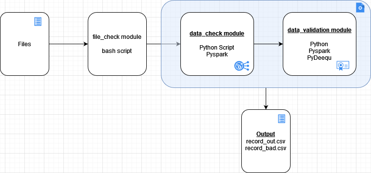

# Data Quality Engineering

This projects it meant to create a process that consume data files, check through that files if they are already processed.
After that it going to clean the data an write it down as _out/_bad data csv depending if the location column has a valid value.
The last step is perfom some data validations using Pydeequ API (built on Spark).

## Technologies

* Python.
* Bash.
* PySpark.
* Pydeequ. [Pydeequ Github](https://github.com/awslabs/python-deequ)

### Setting Up

1. ```python --verison```
2. ```pip install pipenv``` installing pipenv package to manage environments.
3. ```pipenv install``` is going to install all dependencies in pipfiles.
4. ```./file_check.sh``` check file on ./data folder and execute python script to clean and validate unprocessed data files.


#### Post Script
There is a Jupyter Notebook called ```dev_data_check.ipynb``` where I develop every step and test every transformation [Dev purpose]


### Process Diagram


